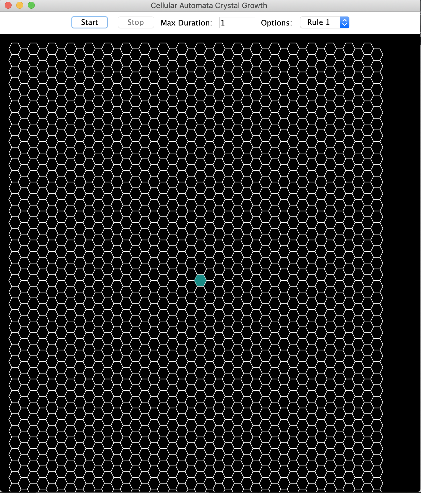
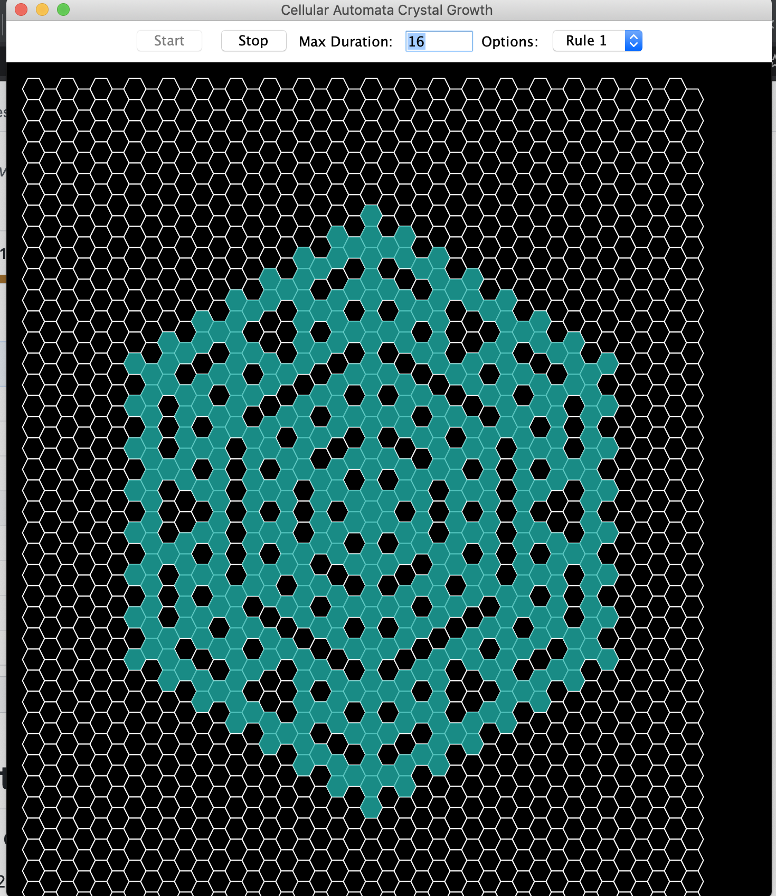
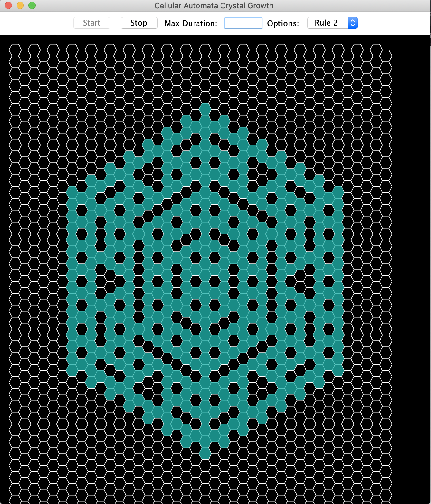
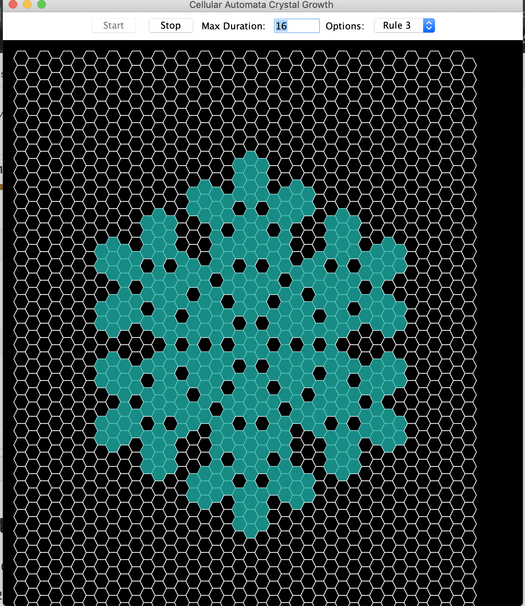

# CellularAutomata 
This projects demonstrates 2D Cellular Automata Crystal Growth 

* CACrystal : which holds a 2D Array of cells
* CACell : helper class which defines the state of cells
* CARule : which can assigns a new cell based on a prior crystal
* CACrystalSet : holds multiple CACrystals and can call the CARule class repeatedly to generate a new crystal state

User Interface application : 
* Selection field to choose an available Rules 
* Input field to specify the maximum number of duration of the CA lifetime 
* Start and Stop button to control the simulation 
* Graphical display panel to display the results of CA Crystal Growth simulation  

### Quick Look
Application Look

Rule1 Simulation

Rule2 Simulation

Rule3 Simulation

### Author
* **Soumya Cherukupalli**
